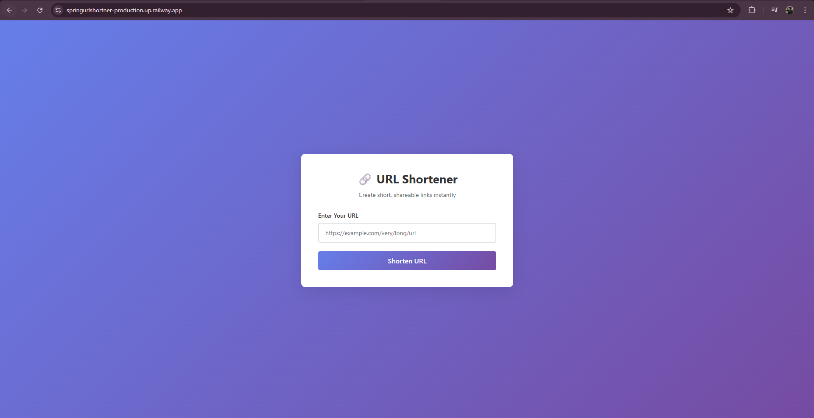
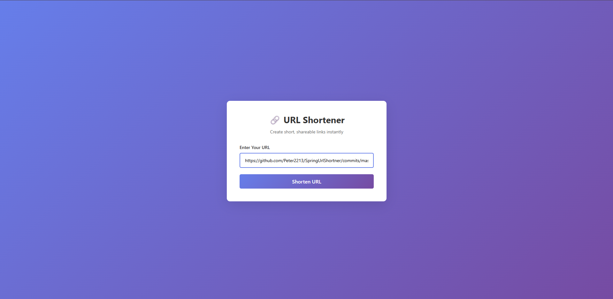
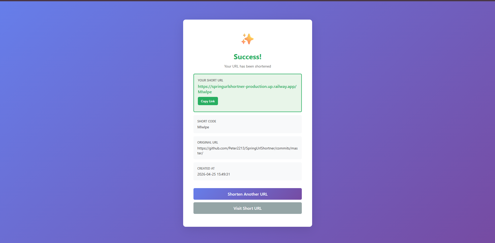

# URL Shortener

A modern, efficient URL shortening service built with Spring Boot. Convert long URLs into short, shareable codes with optional expiration tracking.

Demo :[ https://springurlshortner-production.up.railway.app/]()







## Features

- **URL Shortening**: Convert lengthy URLs into compact, unique short codes
- **URL Expansion**: Redirect short codes to their original URLs
- **Duplicate Detection**: Automatically detects and reuses existing short codes for identical URLs
- **Expiration Management**: Set optional expiration dates for shortened URLs
- **RESTful API**: Clean, intuitive API endpoints for integration
- **Web Interface**: User-friendly form for direct URL shortening
- **Persistent Storage**: MySQL database with JPA/Hibernate ORM
- **Input Validation**: Request validation with detailed error handling

## Technology Stack

| Component             | Technology                 |
| --------------------- | -------------------------- |
| **Framework**   | Spring Boot 4.0.5          |
| **Language**    | Java 17                    |
| **Data Access** | Spring Data JPA, Hibernate |
| **Database**    | MySQL                      |
| **View Engine** | Thymeleaf                  |
| **Build Tool**  | Maven                      |
| **Utilities**   | Lombok                     |

## Getting Started

### Prerequisites

- Java 17+
- Maven 3.6+
- MySQL 8.0+

### Installation

1. **Clone the repository**

   ```bash
   git clone <repository-url>
   cd url-shortner
   ```
2. **Configure Database**

   Update `src/main/resources/application.properties`:

   ```properties
   spring.datasource.url=jdbc:mysql://localhost:3306/urlshortner
   spring.datasource.username=<your-username>
   spring.datasource.password=<your-password>
   ```
3. **Build the Application**

   ```bash
   mvn clean package
   ```
4. **Run the Application**

   ```bash
   mvn spring-boot:run
   ```

   The application will start on `http://localhost:8080`

## API Endpoints

### Create Short URL

**POST** `/shorten`

Creates a new shortened URL. Returns the short code and full short URL.

**Request Body:**

```json
{
  "url": "https://example.com/very/long/url/that/needs/shortening"
}
```

**Response (200 OK):**

```json
{
  "shortCode": "abc123xyz",
  "shortUrl": "http://localhost:8080/abc123xyz",
  "originalUrl": "https://example.com/very/long/url/that/needs/shortening",
  "createdAt": "2026-04-25T10:30:00",
  "expiresAt": null
}
```

### Redirect to Original URL

**GET** `/{shortCode}`

Redirects to the original URL if the short code exists and hasn't expired.

**Response (302 Found):** Redirects to original URL

**Response (404 Not Found):** If short code doesn't exist or has expired

### Home Page

**GET** `/`

Displays the web interface for URL shortening.

## Project Structure

```
url-shortner/
├── src/
│   ├── main/
│   │   ├── java/com/example/url_shortner/
│   │   │   ├── controller/          # Request handlers
│   │   │   ├── dto/                 # Data transfer objects
│   │   │   ├── entity/              # JPA entities
│   │   │   ├── repository/          # Data access layer
│   │   │   ├── service/             # Business logic
│   │   │   ├── util/                # Utility classes
│   │   │   └── UrlShortnerApplication.java
│   │   └── resources/
│   │       ├── application.properties
│   │       ├── templates/           # Thymeleaf templates
│   │       └── static/              # CSS, JS, images
│   └── test/                         # Unit tests
├── pom.xml                           # Maven configuration
└── README.md
```

## Configuration

### Database Configuration

Edit `application.properties` to configure MySQL connection:

- `spring.datasource.url`: Database URL
- `spring.datasource.username`: Database user
- `spring.datasource.password`: Database password
- `spring.jpa.hibernate.ddl-auto`: Schema update mode (update, create, validate)

### Server Configuration

- `server.port`: Application port (default: 8080)

### Logging

Enable detailed SQL logging by setting:

```properties
spring.jpa.show-sql=true
spring.jpa.properties.hibernate.format_sql=true
```

## Development

### Running Tests

```bash
mvn test
```

### Building for Production

```bash
mvn clean package -DskipTests
java -jar target/url-shortner-0.0.1-SNAPSHOT.jar
```

### Database Schema

The application creates a `short_urls` table with the following columns:

- `id`: Primary key (auto-increment)
- `short_code`: Unique short code (max 10 characters)
- `original_url`: Full original URL
- `created_at`: Creation timestamp
- `expires_at`: Optional expiration timestamp

## Key Components

### ShortCodeGenerator

Generates unique, random short codes to minimize collision probability.

### UrlShortenerService

Core business logic handling:

- URL shortening with duplicate detection
- Short code generation and validation
- URL retrieval and expiration checking

### HomeController

Manages HTTP requests:

- Web form submission and display
- Short URL creation with error handling
- Redirect functionality

## Performance Considerations

- **Duplicate Detection**: Prevents creating multiple entries for identical URLs
- **Indexed Lookups**: Short codes are indexed for fast retrieval
- **Connection Pooling**: Optimized database connection management
- **Transaction Management**: Proper transaction boundaries for data consistency

## Error Handling

The application provides comprehensive validation:

- Invalid URL format validation
- Duplicate URL detection
- Expired URL handling
- Request validation with detailed error messages

## Future Enhancements

- User analytics and click tracking
- Custom short code selection
- API key authentication
- Rate limiting
- Advanced statistics dashboard

## License

This project is licensed under the MIT License.

## Support

For issues or questions, please open an issue in the repository.
